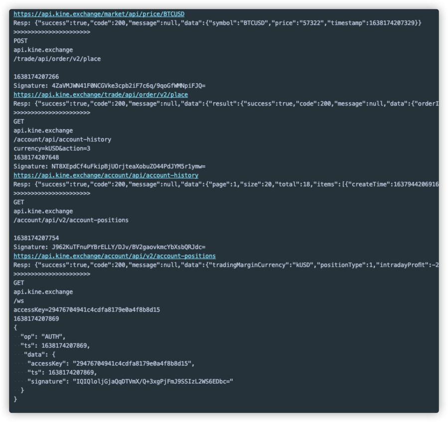

## 此仓库提供了连接KINE API的基本DEMO

运行该DEMO请先创建自己的API KEY并更新至代码中

```java
// 设置你的API KEY
static String API_ACCESS_KEY = "xxxxx";  // 从交易所创建的API KEY
static String API_SECRET_KEY = "xxxxx";  // API KEY对应的Secret Key

```

```java
// 1. 调用公开接口， 不需要签名
// 这里直接调用接口获取最新价格， 实际应用中请监听websocket
String price = getLatestPrice();
System.out.println(">>>>>>>>>>>>>>>>>>>>>>");

// 2. 调用有签名的POST请求
// 使用API下单
placeOrder(price);
System.out.println(">>>>>>>>>>>>>>>>>>>>>>");

// 3. 调用有签名的GET请求
// 查询财务历史
queryAccountHistory();
System.out.println(">>>>>>>>>>>>>>>>>>>>>>");

// 4. 调用有签名但是无参数的GET请求
// 查询账户
queryAccountBalance();
System.out.println(">>>>>>>>>>>>>>>>>>>>>>");


// 5. 创建Websocket身份认证消息
connectWebsocketAndDoAuth();

```

## Console output
